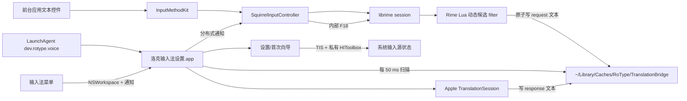
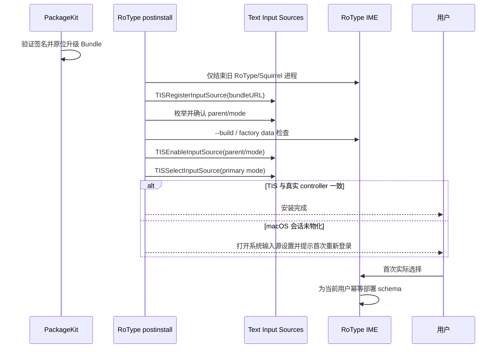

# macOS 开源输入法架构与安装部署对照研究

日期：2026-09-03

## 1. 研究问题

本文回答四个问题：

1. 洛克输入法当前的进程、模块和部署结构，与成熟 macOS 开源输入法有何不同？
2. “设置从输入法菜单打开、不安装独立 `/Applications` App”应采用哪种结构？
3. 输入源首次安装、升级、启用和选择应怎样遵循 macOS 的公开生命周期？
4. 动态翻译应留在常驻 helper、输入法进程，还是独立服务？

研究优先使用 Apple SDK 头文件、项目源码、安装脚本和官方仓库。横向样本包括：Squirrel、Fcitx5 macOS、macSKK、AquaSKK、Gureum、McBopomofo、OpenVanilla、azooKey Desktop 和 vChewing。

> 实施状态（0.2.25）：本文 P0 中的上游 Sparkle 更新链、私有 `AppleEnabledInputSources` 写入、`TextInputMenuAgent` / `ControlCenter` 强杀均已删除；公开 `register -> enable -> select` 和 `tsInputModeDefaultStateKey` 已恢复。TIS 命令会重新枚举并以退出码报告验证结果，失败时进入设置向导，不伪造安装成功状态。RoType factory data 与预编译八股文模型已迁入签名 Bundle，并增加按用户旧文件备份迁移。设置 UI 已改为按需启动，翻译 worker 已拆为独立 Mach service；请求主链路使用共享 typed XPC 合约、签名角色授权、随机 session token、单调 generation、取消、超时和重连，不再扫描请求目录。Secure Input 启用时不请求翻译或写缓存；controller 的真实按键证据由 worker 记录并只允许设置 helper 查询。安装器保留官方 Squirrel，只按精确路径和签名身份结束 RoType 进程，并为所有活跃 GUI session 验证 LaunchAgent；完整 App 备份限三代。为兼容 librime Lua filter，响应仍暂存为每 session 一个缓存文件，属于后续可替换的窄适配层。

## 2. 执行摘要

### 2.1 总体判断

洛克 `0.2.17` 的产品外观方向是对的：系统只安装一个 `/Library/Input Methods/洛克输入法.app`，设置由输入法菜单打开，不在 `/Applications` 出现独立 App，也不显示 Dock 图标。AquaSKK 的主 Bundle 内嵌 `AquaSKKPreferences.app` 是这一布局的直接先例；更多现代项目则把设置窗口直接编进输入法进程。

当前真正的问题不在“helper 是否内嵌”，而在职责与生命周期：

- `洛克输入法设置.app` 同时承担设置 UI、首次向导、输入源验证、Apple Translation session 和动态请求轮询；
- 它由系统级 LaunchAgent 在每个用户登录时常驻；
- Rime Lua 与 helper 通过缓存目录文本文件交换请求和结果，helper 每 50 ms 扫描一次目录；
- 输入法再通过分布式通知和内部 F18 事件刷新 Rime session；
- 安装器同时操作 TIS、私有 HIToolbox 偏好、输入菜单代理和 Control Center。

这使设置、翻译、输入引擎和系统安装状态形成四套生命周期。成熟项目有类似部件，但通常边界更明确：设置属于输入法 UI；需要隔离的转换或网络能力使用 XPC；安装器只管理自己的进程和公开 TIS 状态。

### 2.2 最重要的五项结论

1. **立即停用 Squirrel 上游更新源。** 洛克仍保留 `https://rime.github.io/release/squirrel/appcast.xml`、Sparkle 自动检查和安装服务。定制发行版不能把上游 Squirrel 包当作自己的更新供应链。
2. **删除系统状态旁路。** `AppleEnabledInputSources` 私有偏好写入、`killall TextInputMenuAgent` 和 `killall ControlCenter` 均不应出现在产品安装流程。
3. **修复多用户部署语义。** 系统级 pkg 目前只为安装时的 console user 写入 `~/Library/Rime`。其他用户会看到系统输入法和 LaunchAgent，却没有完整 RoType schema 初始化。
4. **设置 UI 可以内嵌，但不应与翻译 worker 绑定生命周期。** 短期可保留隐藏设置 helper；长期更建议设置窗口进入输入法主进程，翻译执行器独立为有类型协议的服务。
5. **动态翻译的进程隔离有合理先例，但 IPC 应升级。** azooKey 使用 KeepAlive LaunchAgent + Mach XPC 转换服务，证明独立转换进程并非反模式；其 session、超时、重连、有序队列和 Codable 协议，明显比轮询文本文件更完整。

## 3. Apple 平台基线

### 3.1 InputMethodKit 进程模型

Apple SDK 的 `IMKServer.h` 明确要求每个输入法主程序创建一个且仅一个 `IMKServer`。该 server 管理客户端连接，并为每个输入会话创建对应的 `IMKInputController`。因此需要区分：

- 输入法进程：系统按需启动的应用进程；
- IMK server：一个进程级对象；
- input controller：每个客户端输入 session 一个实例；
- 候选窗口和共享引擎状态：通常由进程级 delegate 管理。

来源：[Apple InputMethodKit SDK `IMKServer.h`](https://developer.apple.com/documentation/inputmethodkit/imkserver)。本机 Xcode 26.5 SDK 的头文件也保留了上述契约。

### 3.2 设置窗口是 InputMethodKit 的正式能力

`IMKInputController.h` 对 `showPreferences:` 的说明非常具体：输入菜单提供 action 为 `showPreferences:` 的菜单项后，系统会调用它；默认实现寻找 `preferences.nib`，也可通过 Info.plist 的 `InputMethodServerPreferencesWindowControllerClass` 指定自定义 window controller。

这意味着“从输入法菜单打开设置”不需要独立 `/Applications` App，也不必天然依赖跨进程通知。McBopomofo、OpenVanilla 和 vChewing 都采用这个方向。

来源：[Apple InputMethodKit `showPreferences(_:)`](https://developer.apple.com/documentation/inputmethodkit/imkinputcontroller/showpreferences(_:))、[McBopomofo Info.plist](https://github.com/openvanilla/McBopomofo/blob/f5ba010ce8795d283ee336ca7d16380f200bd2ec/Source/McBopomofo-Info.plist)、[OpenVanilla Info.plist](https://github.com/openvanilla/openvanilla/blob/ffe4d6b4bfd9694d8aaf5109c0f94521b65ce649/Source/Mac/OpenVanilla-Info.plist)。

### 3.3 输入源公开生命周期

Apple `TextInputSources.h` 定义的职责是：

- `TISRegisterInputSource`：注册位于 `/Library/Input Methods` 或 `~/Library/Input Methods` 的 Bundle，触发必要缓存更新，使安装器随后可以立即枚举输入源；
- `TISEnableInputSource`：使输入源可在系统 UI 中选择；
- `TISSelectInputSource`：把已启用、可选择的键盘输入源设为当前输入源；
- mode-enabled 输入法的 mode 只有在 parent 已启用时才能启用和选择；
- TIS API 不保证线程安全，UI App 应在主线程调用。

来源：[Apple SDK `TextInputSources.h` 公开镜像](https://github.com/phracker/MacOSX-SDKs/blob/master/MacOSX10.15.sdk/System/Library/Frameworks/Carbon.framework/Versions/A/Frameworks/HIToolbox.framework/Versions/A/Headers/TextInputSources.h)、[Apple QA1810](https://developer.apple.com/library/archive/qa/qa1810/_index.html)。

Apple 没有把 `com.apple.HIToolbox/AppleEnabledInputSources` 定义为第三方产品 API。直接写该偏好不能替代 TIS 的注册、通知、IMK controller 激活和菜单代理状态转换。

## 4. 横向对照

| 项目 | 安装位置 | 设置实现 | 独立后台服务 | 首次输入源流程 | 升级/重载策略 |
|---|---|---|---|---|---|
| Squirrel | `/Library/Input Methods/Squirrel.app` | 菜单主要打开 Rime 配置目录 | 无 LaunchAgent | `register -> build -> enable -> select` | pkg 要求注销；先结束自己的 Squirrel |
| Fcitx5 macOS | `/Library/Input Methods/Fcitx5.app` | 配置窗口直接在输入法进程 | 无 LaunchAgent | installer `register -> enable`，完成页再 select | 首次建议注销；以后菜单 Restart，只结束 Fcitx5 |
| macSKK | `/Library/Input Methods/macSKK.app` | SwiftUI/NSWindowController 直接在输入法进程 | 内嵌按需 XPC：更新、SKK 网络词典 | 用户在系统设置添加 | postinstall 请求自己的 App 退出 |
| McBopomofo | `~/Library/Input Methods/McBopomofo.app` | IMK preferences controller，主进程内 | 无 | installer register + enable | 替换旧 Bundle、结束自己的进程；升级异常时提示注销 |
| OpenVanilla | `~/Library/Input Methods/OpenVanilla.app` | IMK preferences controller，主进程内 | 无 | installer register + enable | 与 McBopomofo 相近；升级可能提示注销 |
| Gureum | `/Library/Input Methods/Gureum.app` | 主 Bundle 内 prefPane/窗口，主进程显示 | 无 | 主要由用户在系统设置添加 | 结束自己的进程；更新后提示重新登录 |
| AquaSKK | `/Library/Input Methods/AquaSKK.app` | `Contents/SharedSupport/AquaSKKPreferences.app` | 无 LaunchAgent | 老式 pkg | pkg 要求注销 |
| azooKey Desktop | `/Library/Input Methods/azooKeyMac.app` | 设置窗口在输入法主 App | **KeepAlive LaunchAgent + Mach XPC 转换服务** | pkg register + enable，完成页 select | 重启自己的输入法与转换服务 |
| vChewing | 当前安装器偏向 `~/Library/Input Methods/vChewing.app` | 主进程内设置 controller | 无 LaunchAgent | 以当前用户运行 IME 的 install/register 路径 | 只结束自己的进程并迁移旧 Bundle |
| RoType 0.2.17 | `/Library/Input Methods/洛克输入法.app` | `Contents/Helpers/洛克输入法设置.app` | **RunAtLoad LaunchAgent；设置与翻译合并** | register + enable + 私有偏好写入/系统代理重启；不 select | 结束自身进程，但也强杀系统代理 |

### 4.1 Squirrel：洛克应保留的上游基线

Squirrel 的 postinstall 顺序是：结束旧 Squirrel、注册、构建 Rime 数据、以登录用户身份启用、选择。其 Distribution 用 `RequireLogout` 作为首次安装后的会话初始化保障。日常菜单操作不重启 `TextInputMenuAgent` 或 `ControlCenter`。

来源：[Squirrel postinstall](https://github.com/rime/squirrel/blob/0cd71a6130a5866b0ae6ba0494929ebdc8211194/scripts/postinstall)、[InputSource.swift](https://github.com/rime/squirrel/blob/0cd71a6130a5866b0ae6ba0494929ebdc8211194/sources/InputSource.swift)、[Distribution](https://github.com/rime/squirrel/blob/0cd71a6130a5866b0ae6ba0494929ebdc8211194/package/Distribution)。

Squirrel 还把 factory Rime 数据放在主 Bundle `Contents/SharedSupport`，启动时把它作为 `shared_data_dir`，把当前用户目录作为 `user_data_dir`。这天然支持每个用户首次启动时拥有独立用户数据，不要求系统 pkg 在安装时枚举所有用户。

来源：[Squirrel Main.swift](https://github.com/rime/squirrel/blob/0cd71a6130a5866b0ae6ba0494929ebdc8211194/sources/Main.swift)、[SquirrelApplicationDelegate.swift](https://github.com/rime/squirrel/blob/0cd71a6130a5866b0ae6ba0494929ebdc8211194/sources/SquirrelApplicationDelegate.swift)。

### 4.2 Fcitx5：复杂配置仍可在单输入法进程内

Fcitx5 的输入菜单直接打开输入法管理、全局配置、主题、插件和高级窗口。窗口显示时临时将 activation policy 切到 `.regular`，关闭全部配置窗口后恢复 `.prohibited`。它证明即使配置面很复杂，也不必安装第二个可见 App。

来源：[Fcitx5 menu.swift](https://github.com/fcitx-contrib/fcitx5-macos/blob/aae9887e070e798aa15df187dd7dfbc5e6ad0d26/src/menu.swift)、[ConfigWindowController.swift](https://github.com/fcitx-contrib/fcitx5-macos/blob/aae9887e070e798aa15df187dd7dfbc5e6ad0d26/src/config/ConfigWindowController.swift)。

它的 installer 首次安装时 register + enable；完成按钮调用 `TISSelectInputSource`。首次安装建议注销以覆盖全屏候选窗口等会话初始化问题，后续升级只需从菜单重启 Fcitx5。更新脚本明确避免删除必须存在的 Bundle 骨架，因为这可能使输入法进入“已注册但列表不显示”的状态。

来源：[Fcitx5 installer install.sh](https://github.com/fcitx-contrib/fcitx5-macos-installer/blob/a825d02734dac3a9abde874f9dd5164abe63c65d/install.sh)、[installer view.swift](https://github.com/fcitx-contrib/fcitx5-macos-installer/blob/a825d02734dac3a9abde874f9dd5164abe63c65d/src/view.swift)、[Fcitx5 update.sh](https://github.com/fcitx-contrib/fcitx5-macos/blob/aae9887e070e798aa15df187dd7dfbc5e6ad0d26/assets/update.sh)。

### 4.3 macSKK：设置主进程化，外部能力 XPC 化

macSKK 的设置属于同一输入法 App。源码专门记录：macOS 14 后从 IMK `NSMenu` 打开 SwiftUI Settings 的旧方式失效，因此改用自建 `NSWindowController`，但没有为此拆出独立设置 App。

来源：[macSKK InputController.swift](https://github.com/mtgto/macSKK/blob/11af168496e3058e1f69152c18306636f21c0fed/macSKK/InputController.swift)、[macSKKApp.swift](https://github.com/mtgto/macSKK/blob/11af168496e3058e1f69152c18306636f21c0fed/macSKK/macSKKApp.swift)。

它把真正需要隔离的联网能力拆成内嵌 XPC：`FetchUpdateService.xpc` 和 `SKKServClient.xpc`。这些服务按连接启动，具有明确 protocol、超时和连接清理；输入法主体保持沙箱。

来源：[macSKK project](https://github.com/mtgto/macSKK/blob/11af168496e3058e1f69152c18306636f21c0fed/macSKK.xcodeproj/project.pbxproj)、[SKKServService.swift](https://github.com/mtgto/macSKK/blob/11af168496e3058e1f69152c18306636f21c0fed/macSKK/SKKServService.swift)、[UpdateChecker.swift](https://github.com/mtgto/macSKK/blob/11af168496e3058e1f69152c18306636f21c0fed/macSKK/UpdateChecker.swift)。

### 4.4 McBopomofo/OpenVanilla/vChewing：直接使用 IMK preferences 机制

McBopomofo 和 OpenVanilla 都在 Info.plist 指定 `InputMethodServerPreferencesWindowControllerClass`，菜单 action 调 `showPreferences:`。设置和输入核心共享当前进程与偏好存储。

来源：[McBopomofo InputMethodController.swift](https://github.com/openvanilla/McBopomofo/blob/f5ba010ce8795d283ee336ca7d16380f200bd2ec/Source/InputMethodController.swift)、[McBopomofo AppDelegate.swift](https://github.com/openvanilla/McBopomofo/blob/f5ba010ce8795d283ee336ca7d16380f200bd2ec/Source/AppDelegate.swift)、[OpenVanilla OVInputMethodController.mm](https://github.com/openvanilla/openvanilla/blob/ffe4d6b4bfd9694d8aaf5109c0f94521b65ce649/Source/Mac/OVInputMethodController.mm)。

McBopomofo/OpenVanilla 的安装器还记录了一个现实问题：macOS 12+ 可能出现 `kTISPropertyInputSourceIsEnabled == true`，但输入法实际不在当前用户菜单中的情况，因此安装器会再次调用公开的 `TISEnableInputSource`。它们没有因此直接编辑 HIToolbox 私有偏好。

来源：[McBopomofo installer](https://github.com/openvanilla/McBopomofo/blob/f5ba010ce8795d283ee336ca7d16380f200bd2ec/Source/Installer/AppDelegate.swift)、[InputSourceHelper](https://github.com/openvanilla/McBopomofo/blob/f5ba010ce8795d283ee336ca7d16380f200bd2ec/Packages/InputSourceHelper/Sources/InputSourceHelper/InputSourceHelper.swift)。

vChewing 当前部署偏向每用户安装，并明确以 console user 身份执行注册。它同样只操作自己的 Bundle 和进程。

来源：[vChewing pkgPostInstall.sh](https://github.com/vChewing/vChewing-macOS/blob/41c569a0f6a4f7a567d6b2149e55f721cea07d8e/ValueAdd/PKGInstallerAssets/pkgPostInstall.sh)、[TISInputSourceExtension.swift](https://github.com/vChewing/vChewing-macOS/blob/41c569a0f6a4f7a567d6b2149e55f721cea07d8e/Packages/vChewing_IMKUtils/Sources/IMKUtils/TISInputSourceExtension.swift)。

### 4.5 AquaSKK：内嵌设置 helper 的直接先例

AquaSKK 把 `AquaSKKPreferences.app` 放在主输入法的 `Contents/SharedSupport`，设置菜单用 `NSWorkspace` 启动该子 App；子 App 设置 `LSUIElement=1`，不会作为普通 Dock App 展示。这与 RoType 0.2.17 的内嵌 helper 最接近。

来源：[AquaSKK project](https://github.com/codefirst/aquaskk/blob/0e7a88f4713299de2c42c71a088bfe458fc0e3cd/platform/mac/proj/AquaSKK.xcodeproj/project.pbxproj)、[SKKInputController.mm](https://github.com/codefirst/aquaskk/blob/0e7a88f4713299de2c42c71a088bfe458fc0e3cd/platform/mac/src/server/SKKInputController.mm)、[AquaSKKPreferences-Info.plist](https://github.com/codefirst/aquaskk/blob/0e7a88f4713299de2c42c71a088bfe458fc0e3cd/platform/mac/proj/AquaSKKPreferences-Info.plist)。

它证明当前 Bundle 布局是可接受的，但 AquaSKK 没有用 LaunchAgent 让设置 App 常驻，也没有让设置 App 承担输入引擎服务。

### 4.6 azooKey Desktop：常驻转换服务的直接先例

azooKey 把转换状态放进独立 `ConverterServer`，输入法通过 Mach service 的 `NSXPCConnection` 通信。协议包含 session open/close、命令编解码、超时、重连、有序队列和错误处理。LaunchAgent 提供 `MachServices`、`KeepAlive` 和 `RunAtLoad`。

来源：[azooKey ConverterServerClient.swift](https://github.com/azooKey/azooKey-Desktop/blob/7ed6b6d025a405b668fda528037be4410a22256b/azooKeyMac/InputController/ConverterServerClient.swift)、[ConverterServerXPCProtocol.swift](https://github.com/azooKey/azooKey-Desktop/blob/7ed6b6d025a405b668fda528037be4410a22256b/Core/Sources/Core/XPC/ConverterServerXPCProtocol.swift)、[write_converter_server_launch_agent.sh](https://github.com/azooKey/azooKey-Desktop/blob/7ed6b6d025a405b668fda528037be4410a22256b/Tools/write_converter_server_launch_agent.sh)。

azooKey 的设置窗口仍属于输入法主 App。转换服务是无 UI 的单一职责进程。这是 RoType 动态翻译层最值得参考的结构。

## 5. RoType 当前架构



当前优点：

- 键盘事件处理仍由 Squirrel/librime 的成熟主路径负责；
- Apple Translation 不阻塞 Rime 输入线程；
- 请求和响应包含原始输入/候选匹配，能够丢弃过期翻译；
- helper 内嵌且 `LSUIElement=true`，满足无独立 App、无 Dock 图标；
- 动态刷新已不再向系统发送模拟 F18，因此避免 U+E025 泄漏。

当前代价：

- 登录后即使从未使用洛克，也运行一个每秒扫描约 20 次目录的 UI helper；
- 文件名 session ID、文本 codec、目录轮询、分布式通知和内部 Rime 按键共同构成隐式协议；
- 设置窗口崩溃会同时终止翻译服务，翻译服务异常也污染设置进程生命周期；
- `dev.rotype.voice`、`RoTypeVoice` 等旧身份继续存在于新产品运行面；
- 首次向导有能力修改私有系统输入源偏好，与安装器和系统菜单各自维护状态。

## 6. 风险分级

### P0：发布前必须解决

#### 6.1 上游 Sparkle 更新供应链仍启用

`Squirrel/resources/Info.plist` 仍启用自动检查并指向 Squirrel 官方 appcast，`SquirrelApplicationDelegate` 启动 `SPUStandardUpdaterController`，菜单也保留“检查更新”。洛克是不同 Bundle ID、不同功能和不同签名策略的定制发行版，不能接受上游 Squirrel 包作为产品更新。

建议：

- 在洛克自己的 appcast、EdDSA key、回滚策略和签名验证准备好之前，移除 Sparkle UI、初始化、feed 和 installer launcher；
- 同时重新评估主输入法的 `network.client` 和 `disable-library-validation` entitlement；
- 若保留 librime 动态插件，先验证同 Team ID 签名下能否关闭 library validation exception。

#### 6.2 私有 HIToolbox 写入和系统代理强杀

当前 `InputSourceManager.persistInputSourceInMenu()` 直接写 `AppleEnabledInputSources`；postinstall 强杀 `TextInputMenuAgent` 和 `ControlCenter`。九个对照项目均未采用这种组合。它会制造偏好、TIS、IMK 和菜单代理的代际分裂，并把系统进程当作产品内部组件管理。

建议：删除上述三项，只保留公开 TIS 流程和系统原生手动添加入口。

#### 6.3 系统级 pkg 与单用户初始化冲突

payload 安装到 `/Library`，但 postinstall 只处理当前 console user 的 `~/Library/Rime` 和缓存。无人登录安装、MDM 安装、Fast User Switching 和后续新增用户均不能得到一致初始化。

建议优先采用 Squirrel 的 factory/user data 模型：

- RoType schema、Lua 和默认配置放入输入法 Bundle 的 `Contents/SharedSupport`；
- 每个用户第一次启动输入法时由输入法进程完成幂等部署；
- pkg 只安装不可变系统 payload，不写用户主目录；
- 若必须安装每用户文件，则改为明确的 per-user 安装产品，而不是系统 pkg 的 postinstall 副作用。

### P1：近期架构收敛

#### 6.4 设置与翻译 worker 职责混合

建议把设置宿主和翻译服务拆开。两种可接受目标：

- **较少进程方案：** 设置窗口进入 Squirrel 主进程，Apple Translation 也由主进程异步管理；适合确认 TranslationSession 不影响 IMK 稳定性后采用。
- **隔离方案（更稳妥）：** 设置窗口进入主进程或保留按需 LSUIElement helper；翻译独立为无 UI worker，采用 XPC/Mach service；输入法停用或长期空闲时可释放 session。

不建议继续让一个叫 `voice` 的登录 helper 同时承载 UI 和翻译。

#### 6.5 文件轮询 IPC

当前 50 ms Timer 在主 actor 上扫描整个桥目录。它可用于原型，但长期存在性能、竞态、垃圾文件和协议演进问题。

推荐顺序：

1. 先给现有文件协议增加版本、创建时间、request ID、session ID、TTL、原子清理和目录事件监听，移除固定频率轮询；
2. 再把 Squirrel 与翻译 worker 改成有类型 XPC 请求/响应；
3. 由 controller 持有每个 IMK/Rime session 的 generation，响应必须匹配 generation 才能刷新；
4. 取消“内部 F18 是跨模块 API”的做法，提供明确的 `refreshDynamicTranslation(sessionID:)` 适配层；若 librime Lua 暂时必须通过键触发，至少把该细节封装在单一 adapter 内。

#### 6.6 兼容身份未退出运行面

`dev.rotype.voice` 可作为迁移时识别旧版本的常量，但不应继续成为新 helper Bundle ID、LaunchAgent label 和日志 subsystem。建议新建：

- `im.roarkai.inputmethod.Luoke.settings`
- `im.roarkai.inputmethod.Luoke.translation-service`
- `im.roarkai.inputmethod.Luoke` 日志 subsystem

安装器在一个明确版本窗口内清理旧 label 和旧 Bundle；迁移完成后删除兼容代码。

### P2：发布工程质量

#### 6.7 PackageKit 组件定义应显式化

当前构建时用 `pkgbuild --analyze` 生成 component plist，再批量设为不可 relocate。最终包会把主 App、内嵌 helper 和 Sparkle 子组件都识别为 Bundle component。建议在架构稳定后维护显式 component plist，明确主 Bundle 的 child bundles、版本比较和 overwrite 行为，并为安装、升级、降级、损坏修复分别做 payload 测试。

Squirrel 的 component plist 明确设置 `BundleIsRelocatable=false`、版本检查和 child Sparkle framework，可作为基础，但移除 Sparkle 后应同步简化。

#### 6.8 备份缺少保留策略

每次安装都把完整输入法 App 复制到 `/Library/Application Support/RoType/Backups`，长期会无限增长。应将“用户数据备份”和“可重新下载的 signed app payload 备份”分开：

- 用户词典/配置备份保留，并提供数量或容量上限；
- App Bundle 一般不需要每次完整备份，最多保留最近一个可回滚版本；
- 不删除用户旧 Whisper 数据是正确的，但应在文档中提供用户主动清理入口。

## 7. 建议目标架构

推荐采用“单一输入法产品 Bundle + 主进程设置 UI + 单一职责翻译服务”。

```mermaid
flowchart LR
    Client[前台应用] --> IMK[InputMethodKit]
    IMK --> Controller[SquirrelInputController]
    Controller --> Adapter[RoTypeCandidateAdapter]
    Adapter --> Rime[librime]

    Menu[输入法菜单] --> Settings[主 Bundle 内设置窗口]
    Settings --> Preferences[RoType preferences]
    Settings --> Pack[Apple 语言包准备]

    Adapter -->|typed request + generation| XPC[Translation service]
    XPC --> Translation[Apple TranslationSession]
    Translation -->|typed response| Adapter
    Adapter -->|session 内刷新| Rime

    Pkg[签名公证 pkg] --> Bundle[/Library/Input Methods/洛克输入法.app]
    Bundle --> Factory[Contents/SharedSupport/Rime factory data]
    Bundle --> XPC
```

### 7.1 模块边界

**InputMethodHost**

- 创建唯一 IMKServer；
- 管理 controller、候选 UI、Rime session；
- 提供输入菜单和设置窗口；
- 不直接修改系统私有偏好。

**RoTypeCandidateAdapter**

- 从当前 composition 提取 raw input、top candidate 和 generation；
- 管理动态候选请求去抖、取消和过期响应；
- 把翻译结果映射为 Rime 候选刷新；
- 不负责安装、设置窗口或语言包 UI。

**TranslationService**

- 无 UI；
- 按方向复用 TranslationSession；
- 只接受有类型请求并返回结果/错误；
- 处理超时、取消、session 重建和空闲释放；
- 不知道 TIS、输入菜单或 Rime 文件布局。

**Settings**

- 由输入法菜单打开；
- 显示输入源、语言包、隐私与诊断状态；
- 输入源操作只调用公开 TIS API；
- 不承担后台请求循环。

**Installer**

- 安装和验证 immutable payload；
- 只结束/重启洛克自己的进程；
- 对当前用户执行公开的 register/enable/select，失败时引导系统设置；
- 不写用户 Rime 文件，不强杀系统 UI 代理。

## 8. 建议安装与升级状态机



关键规则：

- **首次安装重新登录与日常切换必须分开。** Squirrel、Fcitx5、AquaSKK 等承认首次安装可能需要会话重建，但日常切换和普通升级不依赖重启系统代理。
- **安装成功必须以结果验证，不只看 `noErr`。** 应枚举目标 ID、检查 parent/mode enabled/selectable/current，并在用户真实输入后确认 controller 接管。
- **失败应收敛到系统设置。** macOS 26 外部 `TISSelectInputSource` 可能出现 API current 与 controller owner 不一致；此时让用户通过原生菜单选择比写私有偏好可靠。
- **恢复 `tsInputModeDefaultStateKey` 要与完整生命周期一起验证。** Squirrel、McBopomofo、AquaSKK 和 azooKey 的主要 mode 都设置该键。单独删除它不是稳健修复。

## 9. 分阶段实施建议

### 阶段 A：发布止血

1. 删除/禁用上游 Sparkle feed、菜单和自动 updater。
2. 删除 `AppleEnabledInputSources` 写入。
3. 删除 `killall TextInputMenuAgent` 和 `killall ControlCenter`。
4. 恢复公开 `register -> build -> enable -> select`，并记录每一步的结构化诊断。
5. 恢复主 mode 的 `tsInputModeDefaultStateKey=true`，配合新生命周期做干净用户 A/B。
6. 给 LaunchAgent/helper 改用非 voice 身份，并提供旧 label 的一次性迁移。

### 阶段 B：部署语义修复

1. 把 RoType factory schema/Lua 放入主 Bundle SharedSupport。
2. 把每用户部署移到输入法首次启动，保证多用户和 MDM 场景一致。
3. 明确首次安装是否要求注销；升级只重启自己的进程。
4. 建立安装矩阵：干净安装、0.2.16 升级、0.2.17 升级、第二用户、无人登录安装、快速用户切换。
5. 显式维护 PackageKit component plist 和备份保留策略。

### 阶段 C：进程边界重构

1. 将设置 UI 与 Translation worker 分离。
2. 优先验证 Apple Translation 在嵌入式 XPC 或 Mach service 中的可用性和语言包行为。
3. 若验证通过，采用 Codable XPC 协议、session generation、timeout、cancel、reconnect。
4. 若 Translation framework 不适合 XPC，则放回输入法主进程，但保持 actor 隔离和非阻塞输入路径。
5. 移除 50 ms 文件扫描；过渡期至少使用文件系统事件和严格清理。

### 阶段 D：发布与更新

1. 建立 RoType 自有 appcast、EdDSA key、签名、公证和回滚流程，或继续只发布手动 pkg。
2. 将 Squirrel 上游更新作为依赖升级，由 RoType release 工程吸收和回归，不允许终端用户直接覆盖。
3. 对最终二进制检查 entitlements、动态库、嵌套签名、Bundle ID、LaunchAgent 路径和 payload。

## 10. 验收标准

### 输入与切换

- 洛克、豆包、系统拼音之间连续双向切换 50 次，菜单图标、勾选、owner、TIS current 和实际 controller 同步；
- 不重启 `TextInputMenuAgent`、`ControlCenter` 或整机；
- 动态翻译响应过期时不进入新 composition；
- 不出现 U+E025 或任何模拟功能键泄漏。

### 安装与多用户

- 干净用户首次安装后可通过公开 TIS 路径添加和选择；
- 第二个用户无需重新运行系统 pkg，也能在首次选择后部署 RoType schema；
- 无 console user 的 MDM 安装不写错误 home，不启动错误 GUI domain；
- 升级只结束洛克自己的进程；
- `/Applications` 不出现洛克设置 App，Dock 不出现常驻图标。

### 安全与供应链

- 主输入法不访问 Squirrel 官方 appcast；
- 无不必要网络 entitlement；
- 所有内嵌 helper/XPC 均有独立 Bundle ID、签名和职责；
- 公证后的最终 pkg 展开验证与安装后磁盘验证一致；
- 用户数据迁移和回滚不依赖完整旧 App 无限备份。

## 11. 最终建议

洛克不需要回退到独立 `/Applications` 设置 App。`0.2.17` 的单 Bundle 产品形态应保留。

最稳妥的演进方向不是简单“删除 helper”，而是：

1. 先修复更新供应链和输入源生命周期；
2. 再修复系统级安装与每用户初始化的冲突；
3. 把设置 UI 归入输入法交互层；
4. 把动态翻译变成单一职责、可取消、可重连的服务；
5. 最终移除私有偏好、系统代理强杀、固定轮询文本 IPC 和所有 `voice` 运行时身份。

从开源项目经验看，RoType 最合适的组合不是完整复制某一个项目，而是：

- Squirrel 的 Rime 生命周期和 factory/user data 模型；
- Fcitx5/macSKK/McBopomofo 的主进程设置窗口；
- azooKey 的转换服务 XPC/session 模型；
- macSKK 的按需 XPC、超时和最小权限思路；
- Squirrel/Fcitx5 对首次安装会话重建与日常重启边界的区分。

## 12. 主要源码索引

- Apple InputMethodKit: <https://developer.apple.com/documentation/inputmethodkit>
- Apple QA1810: <https://developer.apple.com/library/archive/qa/qa1810/_index.html>
- Squirrel: <https://github.com/rime/squirrel/tree/0cd71a6130a5866b0ae6ba0494929ebdc8211194>
- Fcitx5 macOS: <https://github.com/fcitx-contrib/fcitx5-macos/tree/aae9887e070e798aa15df187dd7dfbc5e6ad0d26>
- Fcitx5 installer: <https://github.com/fcitx-contrib/fcitx5-macos-installer/tree/a825d02734dac3a9abde874f9dd5164abe63c65d>
- macSKK: <https://github.com/mtgto/macSKK/tree/11af168496e3058e1f69152c18306636f21c0fed>
- AquaSKK: <https://github.com/codefirst/aquaskk/tree/0e7a88f4713299de2c42c71a088bfe458fc0e3cd>
- Gureum: <https://github.com/gureum/gureum/tree/5bdc5dc3df93d5a3aa61ad1df928d76bc903054b>
- McBopomofo: <https://github.com/openvanilla/McBopomofo/tree/f5ba010ce8795d283ee336ca7d16380f200bd2ec>
- OpenVanilla: <https://github.com/openvanilla/openvanilla/tree/ffe4d6b4bfd9694d8aaf5109c0f94521b65ce649>
- azooKey Desktop: <https://github.com/azooKey/azooKey-Desktop/tree/7ed6b6d025a405b668fda528037be4410a22256b>
- vChewing: <https://github.com/vChewing/vChewing-macOS/tree/41c569a0f6a4f7a567d6b2149e55f721cea07d8e>
